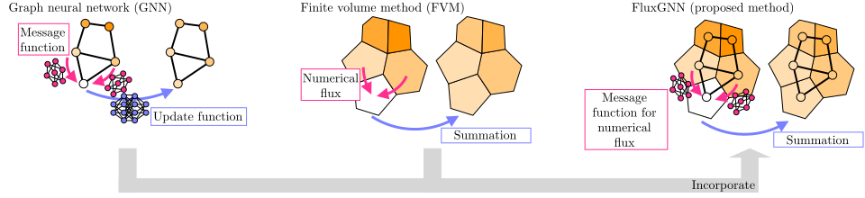

# Graph Neural PDE Solvers with Conservation and Similarity-Equivariance

This repository is the official implementation of an ICML 2024 paper: "[Graph Neural PDE Solvers with Conservation and Similarity-Equivariance](https://openreview.net/forum?id=WajJf47TUi)."


## Reference
```
@inproceedings{
horie2024graph,
title={Graph Neural {PDE} Solvers with Conservation and Similarity-Equivariance},
author={Masanobu Horie and NAOTO MITSUME},
booktitle={Forty-first International Conference on Machine Learning},
year={2024},
url={https://openreview.net/forum?id=WajJf47TUi}
}
```

## Install
NOTE: This project requires Python3.9 and CUDA 11.1.

```setup
$ make install
```

## Download data
1. Download data from https://savanna.ritc.jp/~horiem/fluxgnn_icml2024/datasets.tar.gz or https://drive.google.com/file/d/1VDRnggVqCd4P5vPXHzDZ0CLx34sAIOAy/view?usp=sharing
1. Place `datasets.tar.gz` file in `data` directory
1. Type the following command:

```setup
$ cd data && tar xvf datasets.tar.gz
```

The structure of the data directory is as follows:

```data
data
├── convection_diffusion      # Training / evaluation data for the convection--diffusion dataset
│
├── mixture                   # Training / evaludation data for the mixture dataset
│   ├── raw                   # - Data for FluxGNN models
│   ├── interim               # - Interim data necessary for baseline models
│   ├── preprocessed          # - Scaled data necessary for baseline models
│   │
│   ├── taller                # - Taller dataset
│   └── transformed           # - Rotated and scaled datasets
│
└── pretrained
    ├── convection_diffusion  # Pretrained model for the convection--diffusion dataset
    └── mixture               # Pretrained models for the mixture dataset
```


## Training

### Convection--Diffusion

```train
$ make cd_fluxgnn_train  # FluxGNN
```

### Mixture

```train
$ make mixture_fluxgnn_train  # FluxGNN
$ make mixture_penn_train  # PENN
$ make mixture_mppde_train  # MP-PDE
```

## Evaluation

### Convection--Diffusion

```eval
$ make cd_fluxgnn_eval  # FluxGNN
$ make cd_fvm_eval  # FVM
```

### Mixture

```eval
$ make mixture_fluxgnn_eval  # FluxGNN
$ make mixture_penn_eval  # PENN
$ make mixture_mppde_eval  # MP-PDE
$ make mixture_fvm_eval  # FVM
```

## License

[Apache License 2.0](./LICENSE).
